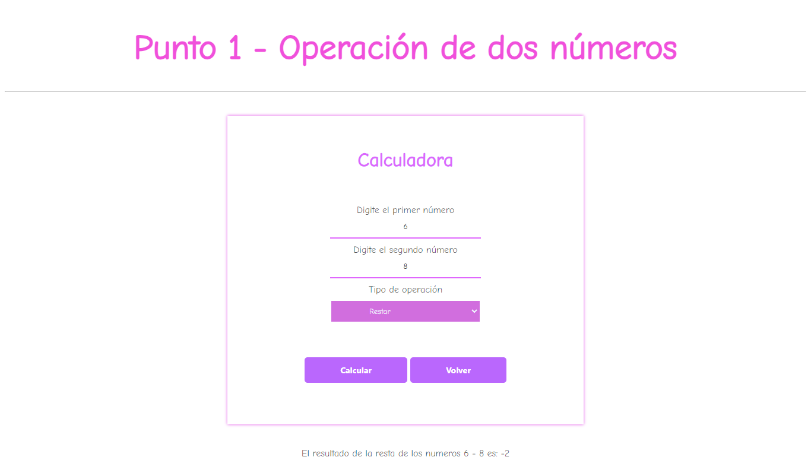

<h1>Taller 6 Luisa Fernanda Herrera Chávez </h1>

<h2> Información</h2>

Curso: Full Stack Intermedio 

<h2> Proyecto BackEnd</h2>
<h3>Registro</h3>

<h3>Login</h3>

<h3>Bienvenida</h3>

<h3>Modulo 1</h3>

<h3>DB</h3>

<h2> Punto 1: Operación de dos números</h2>

<h2> Punto 2: Calculo de mayoria de edad</h2>

<h2> Punto 3: Enviar datos del usuario</h2>

<h2> Punto 4: </h2>

<h2> Punto 5: </h2>

<h3>Base de datos- phpMyAdmin</h3>

<h3>Datos en pantalla</h3>

